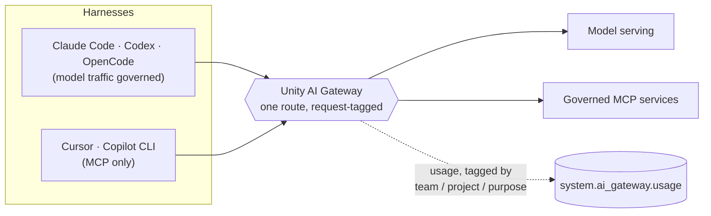

# Databricks Agentic Engineering Rails

**Get a coding agent set up on your own laptop — governed through Unity AI Gateway,
with permissions that actually refuse things — in about thirty minutes.**


You have a laptop, a harness you already like, and a Databricks workspace. This
repository gets you from that to a session whose model spend is attributable, whose
tools are governed by Unity Catalog, and which will not force-push to a shared branch
because a file it read told it to.

Five harnesses are supported — Claude Code, Codex CLI, Cursor CLI, GitHub Copilot CLI
and OpenCode. They are **not** equivalent, and the table below says how they differ
before you pick one.

```sh
git clone https://github.com/althrussell/databricks-agentic-engineering-rails
cd databricks-agentic-engineering-rails
./scripts/doctor.sh                       # is this laptop ready
```

Then open your harness's setup page. That is the whole path.

| Harness | Setup | Model traffic governed | Never-automatic tier enforced |
| :--- | :--- | :--- | :--- |
| Claude Code | [`harness/claude-code/SETUP.md`](harness/claude-code/SETUP.md) | Yes | Before the command runs, and journalled |
| Codex CLI | [`harness/codex/SETUP.md`](harness/codex/SETUP.md) | Yes | By posture and review |
| OpenCode | [`harness/opencode/SETUP.md`](harness/opencode/SETUP.md) | Yes | By pattern, three verdicts |
| Cursor CLI | [`harness/cursor/SETUP.md`](harness/cursor/SETUP.md) | No — tools only | By rule and review |
| GitHub Copilot CLI | [`harness/copilot-cli/SETUP.md`](harness/copilot-cli/SETUP.md) | No — tools only | By launch flag and review |

Two columns, not five green ticks. `ug` routes model traffic for four of the five; for
Cursor it registers MCP servers only. And only Claude Code can stop a
never-automatic command *before* it runs — the others record the intent and rely on a
human reading the diff. Each harness's generated `RENDER-NOTES.md` says this about that
harness and nothing about the others, so the strongest one's guarantees cannot be
mistaken for yours.

---

## Contents

- [Who should read this](#who-should-read-this)
- [Which track are you on?](#which-track-are-you-on)
- [Why you should care](#why-you-should-care)
- [The four ideas](#the-four-ideas)
- [How the gate is enforced](#how-the-gate-is-enforced)
- [What is in this repository](#what-is-in-this-repository)
- [Documentation site](#documentation-site)
- [What this does not do](#what-this-does-not-do)
- [Contributing](#contributing)

---

## Who should read this

| If you are | Read this because | Start at |
|---|---|---|
| **An engineer about to use a coding agent on real work** | It gives you a harness that is configured, not improvised: permission tiers that have been watched refusing something, a gateway route that has been watched answering, and one command that tells you whether your machine is ready. | `./scripts/doctor.sh`, then your harness's `SETUP.md` |
| **A tech lead setting a team standard** | It is the standard, written down, with the decisions and the rejected alternatives attached — so you inherit an argument that has already been had rather than having it again in six months. | [`docs/02-permissions.md`](docs/02-permissions.md), then [`docs/DECISIONS/`](docs/DECISIONS/) |
| **A platform or workspace admin** | Agent traffic is model spend, and model spend is invisible until it is governed. This shows the route to enforce, the request tags that make usage attributable, and what a client-side environment variable does and does not control. | [`docs/03-gateway-auth.md`](docs/03-gateway-auth.md) |
| **A security or risk reviewer** | It states what each mechanism enforces, what defeats it, and what was deliberately not proved. | [`docs/02-permissions.md`](docs/02-permissions.md), then your harness's `RENDER-NOTES.md` |
| **Someone who will never clone this** | The six documents in [`docs/`](docs/) are written to be read on their own, with no repository and no network. `make docs` builds them as PDFs. | [`docs/00-start-here.md`](docs/00-start-here.md) |

If none of those is you and you have ten minutes, read
[The four ideas](#the-four-ideas). They are the whole argument.

## Which track are you on?

One question: **does the thing you are shipping have to run on Databricks?**

**Track A — you are building a Databricks App.** The platform is both your runtime and
your governance plane. Read [`docs/03-gateway-auth.md`](docs/03-gateway-auth.md) for how
sessions authenticate, then the AppKit and Apps sources in
[`docs/SOURCES.md`](docs/SOURCES.md). This repository's own `make check` is the shape a
Track A repository's CI should have.

**Track B — you are writing software with nothing to do with Databricks, and you want
the models governed anyway.** This is the more common case and it works: the gateway is
a model endpoint and an MCP registry, and neither cares what you are building.
Everything here applies except the Apps-specific sources. Your CI runs wherever your
code lives, which is why [`docs/05-ci-test-docs.md`](docs/05-ci-test-docs.md) is written
to be forge-agnostic.

**Both tracks share the same first thirty minutes.** The split only starts to matter
once you are productive, which is why the setup path does not ask you to choose.

## Why you should care

Three things go wrong quietly when a team starts using coding agents, and all three are
invisible until someone goes looking:

1. **Spend with no owner.** Every session is model spend. Without a governed route and
   request tags, the bill arrives as one number and nobody can attribute it to a team, a
   project or a purpose.
2. **Tools with no governance.** An MCP server registered directly is subject to Unity
   Catalog permissions but invisible to the gateway — no usage row, no rate limit. The
   two routes look almost identical and only one of them is observable.
3. **A permission model that reads well and enforces nothing.** Most harness
   configuration formats have an allow list and a deny list. The interesting tier is the
   middle one, and three of the five harnesses here cannot express it.

None of that is solved by a document telling people to be careful. It is solved by a
configuration that ships, a probe that runs on your workspace rather than ours, and a
check that fails.

## The four ideas

### One route


Every model call and every MCP call from every harness goes through one governed
gateway route. Not because it is tidier, but because it is the only place where
spend, attribution and refusal are all observable at once.



Only `{workspace}/ai-gateway/mcp-services/{catalog.schema.name}` passes through the
gateway. The `{workspace}/api/2.0/mcp/...` route is governed by Unity Catalog but
invisible to the gateway: no usage row, no rate limit. Both work; only one is
observable. [`docs/03-gateway-auth.md`](docs/03-gateway-auth.md) has the distinction in
full.

**Two findings worth reading before you rely on the diagram.**

A session started with gateway environment variables is not proof that the gateway
served it. During this build, a session started with a deliberately invalid gateway
token answered normally — it had fallen back to the ambient harness login. Client-side
environment variables are a default, not a control. Verify from the gateway side, using
the usage tables filtered on the request tags. Every launcher here sets those tags for
exactly that reason.

And **route availability is per workspace, not per product.** On the build workspace the
Anthropic route answered 200, the Codex route 404 and the Gemini route 400. That is why
every generated `launch.sh` probes rather than assumes:

```sh
./harness/<name>/launch.sh --explain     # probe the route, print what it found, run nothing
```

Registering MCP servers is not free either, so it is measured rather than argued about:

```sh
make tool-budget         # offline: reports a LOWER BOUND, and says so
make tool-budget-live    # measures what the server actually advertises
```

Every registered tool costs context in every session whether or not it is called. The
live mode also compares the allowlist against what the server advertises **in both
directions**, because a tool advertised but not allowed is context spent on nothing, and
a tool allowed but not advertised is a policy line that constrains nothing while reading
as though it does.

### Three tiers


| Tier | Intent | Enforced by |
|---|---|---|
| **auto-allow** | Worst outcome is a wasted minute and a dirty working tree. Reversible with `git`, touches nothing outside the repository. | Permission rules |
| **ask** | The action leaves the machine or becomes visible to someone else. A prompt costs seconds; an unreviewed push costs a conversation. | Permission rules |
| **never-automatic** | No approval flow should make this routine, because the failure is not recoverable by the person who approved it. | Permission rules **and**, where the harness supports it, a guard script that journals every decision |

Sessions default to the mode that asks before acting. The middle tier is the one that
does the work, and it is the one most likely to be missing: an allow list plus a deny
list has no way to say "this is fine, but tell me first".

The last tier is deliberately enforced twice where it can be, and the reason is the
whole design in one sentence: **a pattern that matches leaves no record, and a guard can
write one.** Which mechanism you are relying on depends on your harness:

| Mechanism | Enforces | Defeated by |
|---|---|---|
| Permission rules | The canonical spelling of each tier | An unusual spelling of the command |
| The guard script (Claude Code) | The never-automatic tier, on normalised text, before the command runs, with a journal entry | The action expressed as data: base64, a written-then-run script, a runtime's own process API |
| Posture and review (Codex) | Nothing automatically. The tier is written into `AGENTS.md` | Nobody reading the diff |
| A deny list (Cursor, OpenCode, Copilot CLI) | The tier as a refusal, with no journal | An unusual spelling, and in Cursor's case the absence of a middle tier |

None of these solves prompt injection. Every one of them limits the blast radius of an
injection that has already succeeded. And the permission rules are not a security
boundary: they are the difference between an accident and a deliberate act.

Prove it rather than trusting it:

```sh
make harness-deny-proof    # 46 cases against the guard's verdict table
```

Forty-six cases: 27 that must be denied, 19 that must be allowed, every guard rule
exercised at least once. A verdict table with an unexercised rule is a rule nobody has
checked.

### Evidence, not adjectives


Every source behind a claim is listed in [`docs/SOURCES.md`](docs/SOURCES.md) with the
URL, the HTTP status it returned and the date it was read — including the four
candidates that were **excluded**, and why.

Two words are used carefully, and they are not synonyms:

| Word | Means |
|---|---|
| **verified** | A real call over that route returned 200 during the build. |
| **documented** | The route was probed and the behaviour is described by a source, but nothing was exercised. |

The second is used more often than the first, and every generated `RENDER-NOTES.md`
closes with a "what is not proved" section rather than leaving the reader to infer it.
The same applies to the checks: a check that cannot run exits non-zero rather than
reporting a pass it has not earned. `verify.sh` exits 2 when no sha256 tool exists,
because "nothing to check" and "everything checks out" are different results.

### One entry point

Two ways to run the checks means one of them rots. So every check a human runs and every
check a pipeline runs is a target in the `Makefile`. **If CI does something the
`Makefile` cannot do, that is a defect in the `Makefile`.**

| Command | Needs | Belongs in |
|---|---|---|
| `make check` | Nothing. No network, no workspace, no credentials. | The pull-request lane. A check that can fail because someone else's web server is down does not belong here. |
| `make check-live` | Network, and a workspace. | A scheduled lane, or a manual run. Failures here are news about the world, not about the change under review. |

## How the gate is enforced

**The gate is a command, not a workflow file.** `make check` runs `lint`, `links`,
`harness-verify` and `test`, then the tool budget, and exits non-zero on the first
failure. It needs no network, no credentials and no workspace, so it runs identically on
a laptop and in whatever runner you already have.

This repository ships **no workflow file at all** — not a disabled one, not an example
one. Recorded with its cost in
[decision 0005](docs/DECISIONS/0005-the-gate-is-a-command.md). The immediate reason is
that the destination this pack is delivered into runs no GitHub Actions, which is a
common situation alongside a self-hosted forge with Actions disabled, GitLab, Azure
DevOps and a mirrored read-only remote. The better reason is that a pack whose
enforcement lives in `.github/workflows/` teaches its readers that CI is a GitHub
feature. The lesson worth teaching is that the gate is a command, and CI is whatever
happens to invoke it.

In your own repository, the porting exercise is one line:

```yaml
- run: make check
```

**The honest cost, not dressed up:** here, nothing blocks a push. The gate is a command
a developer runs and a reviewer can ask about, which is weaker than a required status
check because both can be skipped by one person in a hurry. Said here rather than
implying a coverage that does not exist.

## What is in this repository

```
Makefile                    the one entry point. `make help` lists everything
template-version.yml        the versions this pack was exercised against, read by
                            doctor.sh and build-docs.py rather than restated in them

harness/
  shared/                   the policy, once, in a neutral vocabulary:
                            permissions.yml, gateway.yml, mcp.yml, guards/
  claude-code/  codex/      one directory per harness. Generated from shared/ and
  cursor/  copilot-cli/     never hand-edited, except the hand-written SETUP.md.
  opencode/                 verify.sh enforces that. RENDER-NOTES.md says what each
                            harness cannot express
  scripts/                  render.py, generate.sh, verify.sh, deny-proof.sh

scripts/
  doctor.sh                 machine report. POSIX sh, so it works when python does not
  link-check.sh             internal links, anchors and link text. Also POSIX sh
  tool-budget.py            what the MCP configuration costs in context
  build-docs.py             the PDF pipeline, with an overflow check that fails the build

docs/
  00-start-here.md          … 05-ci-test-docs.md — the six documents
  SOURCES.md                every URL, its status code, and the date it was read
  DECISIONS/                four decision records, each with its rejected
                            alternatives and the condition that should reopen it
  theme/pack.typ            the PDF theme
  assets/img/               the illustrations, and a note on how they were made
  index.md                  the documentation site homepage
```

Two files worth opening even if you read nothing else: your harness's
`RENDER-NOTES.md`, because it is the only page that is entirely about what your setup
cannot do; and [`docs/DECISIONS/README.md`](docs/DECISIONS/README.md), because it states
that an agent may draft a decision record but a human owns the decision, and why that
rule exists.

## Documentation site

**<https://althrussell.github.io/databricks-agentic-engineering-rails/>**

Published with plain GitHub Pages, built from `main` and the `/docs` folder. **No
Actions, no build step, no workflow file** — the same constraint that shaped the gate.
Configuration is `docs/_config.yml`, the homepage is `docs/index.md`, and every page is a
Markdown file that renders correctly in a plain text editor, on GitHub, and on the site.

The PDFs are a separate artifact, built by `make docs` from the same Markdown. They are
not committed: a binary that changes on every build makes every diff useless.

One thing worth knowing before you fork: **plain Pages needs the repository to be
public**, unless you have GitHub Enterprise Cloud. This repository was private first, and
enabling Pages returned `422 Your current plan does not support GitHub Pages for this
repository` — a plan limit, not a configuration mistake, and not obvious from the error.
If neither option is open to you nothing is lost: every document is Markdown in `docs/`,
readable in place, and `make docs` produces the PDFs.

## What this does not do

Stated here rather than discovered later.

- **It does not solve prompt injection.** Every mechanism limits blast radius. None
  prevents an injection.
- **It does not make the permission rules a security boundary.** They are the difference
  between an accident and a deliberate act.
- **It does not sandbox anything.** Sandboxes and containers are out of scope. This
  configures the harness you are already running on the laptop you already have.
- **It does not touch your live configuration.** No script here writes to your harness
  configuration directories or a managed settings file. Each `SETUP.md` tells you which
  file to copy where, and you copy it.
- **It does not claim the five harnesses are equivalent.** Two of them do not route
  model traffic through the gateway and one cannot express the never-automatic tier at
  all. That is in the table at the top, not in a footnote.
- **It does not claim portability it has not tested.** Only OpenTofu was exercised for
  infrastructure-as-code; Terraform parity is untested. `macOS` is the only platform the
  checks were run on.
- **It is not a Databricks product.** See [`DISCLAIMER.md`](DISCLAIMER.md). Nothing here
  is supported software, and every reference is to public documentation, recorded in
  [`docs/SOURCES.md`](docs/SOURCES.md) with the date it was read.

## Contributing

Read [`docs/DECISIONS/README.md`](docs/DECISIONS/README.md) first — the format, and the
rule about who owns a decision. Then:

```sh
make check          # must pass. It is hermetic, so there is no excuse
```

Two rules that are enforced rather than requested:

1. **Never hand-edit a generated file.** Change `harness/shared/`, run
   `make harness-generate`, review the diff. That diff *is* the review of the policy
   change. `make harness-verify` distinguishes "the policy moved" from "someone edited
   the output", because those look identical in a diff and mean opposite things.
2. **A new claim about an external system needs a row in
   [`docs/SOURCES.md`](docs/SOURCES.md)** with the URL, the status it returned and the
   date. A claim that cannot name its source does not go in.

A note on the checks themselves: each one has been run against a planted defect to prove
it fails. A checker that has only ever been seen passing is a checker nobody has tested.
If you add one, plant a defect and show it caught.

The images in `docs/assets/img/` are decorative and generated; if you fork this for your
own organisation, replace them, and keep the note explaining how.

## Licence

Code and documentation are licensed under the terms in [`LICENSE`](LICENSE). Third-party
notices are in [`NOTICE`](NOTICE). [`DISCLAIMER.md`](DISCLAIMER.md) states what this is
not.
