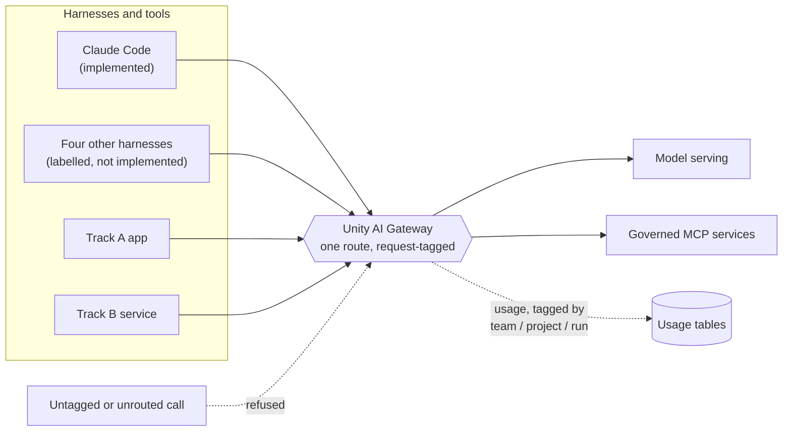
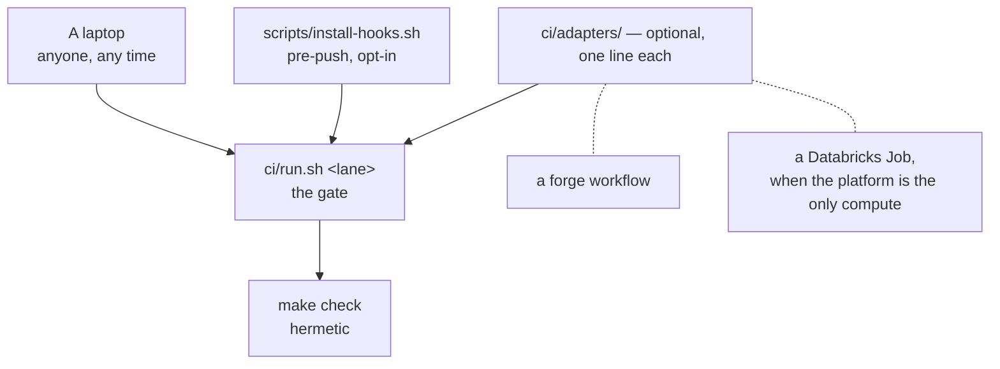

# Databricks Agentic Engineering Rails

**Standards, working code and proofs for building software with coding agents on
Databricks — to a production standard, on rails a team can actually follow.**


Two tracks, one set of rails:

- **Track A — Databricks Apps.** TypeScript, AppKit-first, deployed as a
  Databricks App, with real end-to-end tests against a real deployment.
- **Track B — off-platform engineering.** Any language, any repository, anywhere
  — using models hosted on Databricks through a governed gateway, and nothing
  else from the platform.

Both tracks share the same harness, the same permission tiers, the same gateway
route, the same gates and the same standard of evidence. That sharing is the
point: a team should not need two engineering cultures because half its work
deploys to Databricks and half does not.

> **Status: PREVIEW. Phase 1 of 6 is complete.** The harness is implemented and
> verified against a live workspace. The 21 documents, the two reference
> applications, the labs and the validation kit are **not written yet**. Nothing
> in this repository is marked as passing that has not been run. Read
> [Where this actually is](#where-this-actually-is) before planning around it.

---

## Contents

- [Who should read this](#who-should-read-this)
- [Why you should care](#why-you-should-care)
- [Where this actually is](#where-this-actually-is)
- [Start here](#start-here)
- [The four ideas](#the-four-ideas)
- [How the gate is enforced](#how-the-gate-is-enforced)
- [What is in this repository](#what-is-in-this-repository)
- [Documentation site](#documentation-site)
- [What this does not do](#what-this-does-not-do)
- [Contributing](#contributing)

---

## Who should read this

| If you are | Read this because | Start at |
|---|---|---|
| **An engineer about to use a coding agent on real work** | It gives you a harness that is configured, not improvised: permission tiers that have been watched refusing something, a gateway route that has been watched answering, and a single command that tells you whether your machine is ready. | `make doctor`, then `harness/claude-code/README.md` |
| **A tech lead or staff engineer setting a team standard** | It is the standard, written down, with the decisions and the rejected alternatives attached — so you inherit an argument that has already been had rather than having it again in six months. | `docs/DECISIONS/` and `quality-attributes.yml` |
| **A platform or workspace admin** | Agent traffic is model spend, and model spend is invisible until it is governed. This shows the single route to enforce, the request tags that make usage attributable, and what a client-side environment variable does and does not control. | `harness/shared/gateway.yml` and `harness/evidence/verify-in-sandbox.md` |
| **A security or risk reviewer** | It states what each mechanism enforces, what defeats it, and — in one file — what was actually run, on what, and what was deliberately not proved. | `harness/evidence/verify-in-sandbox.md`, then `harness/shared/boundary.yml` |
| **Someone who will never clone this** | There is a standalone digest of the recommendations, frameworks and practices, designed to be read on its own with no repository and no network. | `docs/00-recommendations-and-practices.md` (Phase 3) |

If none of those is you and you have ten minutes, read
[The four ideas](#the-four-ideas). They are the whole argument.

## Why you should care

Coding agents got good enough to use on production systems faster than most
engineering organisations got a position on them. The result is a predictable
shape of failure, and it is rarely the one people worry about:

| The worry | What actually happens |
|---|---|
| "The agent will write bad code." | Reviewers catch bad code. What they do not catch is **code nobody read**, because it was generated in bulk, looked plausible, and the diff was large enough that reviewing it properly felt optional. |
| "The agent will delete something." | Occasionally. Far more often it does something *ordinary and irreversible* — a force-push, a published package, a deployment — because no tier ever said that action was different from editing a file. |
| "Costs will run away." | They do, but silently and without attribution. Nobody can say which team, project or session spent it, so the response is a blanket restriction rather than a decision. |
| "It will leak secrets." | The usual leak is not dramatic: a credential file read by a helper process that runs outside every boundary anyone configured, because nobody checked where that helper runs. |
| "Tests will be stubs." | They will. `assert response.status_code == 200` against a mock is the default output of asking for a test, and it passes forever, including after the feature breaks. |

None of those is solved by choosing a better model. They are solved by rails:
one route, three tiers, real tests, and evidence instead of adjectives. That is
what this pack is.

**The bar it sets:** a team of five engineers who have never used a coding agent
seriously can spend one day on this material and end it with a governed harness,
a passing gate, and one small change shipped with evidence attached to the pull
request. That bar is written down as success test `st-1` in
`release-readiness.yml`, along with the three others — and all four are recorded
as `not-run`, because they are closed by people and no cohort has run them yet.

## Where this actually is

This section exists so that nobody plans around work that has not happened. It
is generated from `repo-manifest.yml` and `release-readiness.yml`, which
`make check` validates on every run.

```
Phase 0  manifests, schemas, verified sources, enforced checks     complete
Phase 1  the reference harness, implemented end to end             complete   <- you are here
Phase 2  reference application (Track A) and service (Track B)     not started
Phase 3  the 21 documents and the PDF release                      not started
Phase 4  the labs                                                  not started
Phase 5  the validation kit                                        not started
Phase 6  the portable gate, CHANGELOG, handover                    not started
```

What is real today, with the number that says so:

| Built and checked | Figure |
|---|---|
| Hermetic checks in `make check` — no network, no credentials | **22 checks, 0 failed, 4 warned** (the four warnings name Phase 5 files that do not exist yet, by design) |
| Planted defects the validator's self-test must catch | **16 planted, 16 caught** |
| Permission-guard verdict cases | **46 cases (27 deny, 19 allow), 6 of 6 guard rules exercised** |
| Load-bearing external claims, each with its source and method | **40 claims — 38 verified, 2 verified-absent** |
| Public sources checked and pinned | **52 candidates, 51 reachable, 50 cited** |
| Assertions run against a live workspace | **13 passed, 0 failed, 0 inconclusive** |
| Harnesses implemented | **1 of 5** — Claude Code. The other four are labelled, not implemented |

What is **not** here yet, stated plainly:

- **The 21 documents.** `release-readiness.yml` lists every one of them with
  `status: planned`. `make docs` currently reports "source not written yet" for
  all of them. There is no PDF release.
- **The two reference applications.** No Track A app, no Track B service, no
  `databricks.yml`, no `scripts/new-project.sh`.
- **The labs.** The guided path from zero to capable does not exist yet.
- **The validation kit.** Three of the four success tests are closed by people,
  and the written protocols they need are Phase 5.
- **A verified container boundary.** `.devcontainer/` is a *verified recipe and
  not a verified environment*: no container runtime was found on the machine the
  harness was verified on, so that layer has never been exercised. Tracked as
  gap `g-container-runtime`, and it is published rather than papered over.
- **Proof that a session's model traffic went through the gateway.** The route is
  proved over HTTP, including with a negative control. Where a *session* sends
  its traffic is a different question, and the finding about environment
  variables below is why.

## Start here

Three doors, by how much time you have. None of them needs a Databricks
workspace except the third.

### Sixty seconds — is this machine ready?

```sh
make doctor
```

A table of what this machine has against what the pack was exercised with,
designed to be pasted into a ticket. It never prints your workspace URL — only
whether it is set — because a workspace URL is an environment identifier.

### Ten minutes — run every check, then read the diff

```sh
make deps          # optional: a pinned virtualenv, so the checks do not depend
                   # on whatever your system python happens to have
make check         # hermetic. No network, no credentials, no workspace.
make help          # every target, one line each
```

`make check` is the gate. If it passes on your laptop it passes anywhere,
because it reaches nothing. Then change one line in `harness/shared/` and run:

```sh
make harness-generate
git diff
```

**That diff is the review of a policy change.** The generated harness
configuration is never hand-edited; `make harness-verify` fails the build if
anyone does, and it distinguishes "the policy moved and nobody regenerated" from
"someone edited the output", because those look identical in a diff and mean
opposite things.

### A day — launch a governed session and watch it refuse something

```sh
databricks auth login --profile your-profile     # you run this, once
./harness/claude-code/launch.sh --explain        # resolve, probe, print, do nothing
./harness/claude-code/launch.sh
```

`--explain` turns "the model is erroring" into "this workspace does not expose
that route", which is a different conversation with a different person. Run it
first on any new machine.

Then prove the whole thing against your own workspace:

```sh
make harness-verify-sandbox PROFILE=your-profile
```

Thirteen assertions in five stages — that the files under test are the
generator's output, that a token can be minted, that a real model call goes
through the governed route **and that the same call with an invalid token is
refused**, where the MCP header helper actually runs, and that the
never-automatic tier refuses inside a live session and journals which rule
fired. It writes `harness/evidence/verify-in-sandbox.md` with the workspace host
reduced to a shape, and it runs its sessions in a scratch project with its own
config directory, then asserts afterwards that **your own harness state was
neither modified nor given an entry**.

> **Accept the trust dialog once per clone.** Until you do, every
> `permissions.allow` entry is silently discarded and the session queries every
> routine command. Deny rules and hooks keep working, so nothing is less safe —
> it just looks broken. Starting a session interactively in the directory once
> is enough.

## The four ideas

### One route


Every model call and every MCP call from every harness goes through one governed
gateway route. Not because it is tidier, but because it is the only place where
spend, attribution and refusal are all observable at once.



The uncomfortable finding this produced, recorded in the evidence file and worth
reading before you rely on the diagram: **a session started with gateway
environment variables is not proof that the gateway served it.** During this
build, a session started with a deliberately invalid gateway token answered
normally — it had fallen back to the ambient harness login. Client-side
environment variables are a default, not a control. Enforce the route with
managed settings on the machine, and verify from the gateway side using the
usage tables filtered on the request tags. Every launch in this pack sets those
tags for exactly that reason.

Registering MCP servers is not free either, so it is measured rather than
argued about:

```sh
make tool-budget         # offline: reports a LOWER BOUND, and says so
make tool-budget-live    # measures what the server actually advertises
```

Every registered tool costs context in every session whether or not it is
called. The live mode also compares the allowlist against what the server
advertises **in both directions**, because a tool advertised but not allowed is
context spent on nothing, and a tool allowed but not advertised is a policy line
that constrains nothing while reading as though it does.

### Three tiers


| Tier | Intent | Enforced by |
|---|---|---|
| **auto-allow** | Worst outcome is a wasted minute and a dirty working tree. Reversible with `git`, touches nothing outside the repository. | Permission rules |
| **ask** | The action leaves the machine or becomes visible to someone else. A prompt costs seconds; an unreviewed push costs a conversation. | Permission rules |
| **never-automatic** | No approval flow should make this routine, because the failure is not recoverable by the person who approved it. | Permission rules **and** a guard script that journals every decision |

Sessions default to the mode that asks before acting. The three defaults behind
the tiers: read-only unless a write is explicitly enabled; fail safe, holding
rather than proceeding on low confidence or error; and every automated decision
journalled so it can be reviewed and overridden.

The last tier is deliberately enforced twice, and the reason is the whole design
in one sentence: **a pattern that matches leaves no record, and a guard can
write one.** Four mechanisms carry the load, and they fail independently, so a
reader should know which one they are relying on:

| Mechanism | Enforces | Defeated by |
|---|---|---|
| Permission rules | The canonical spelling of each tier | An unusual spelling of the command |
| The guard script | The never-automatic tier, on normalised text, with a journal entry | The action expressed as data: base64, a written-then-run script, a runtime's own process API |
| The sandbox block | Reads of credential paths, egress to unlisted hosts, the unsandboxed retry | A platform with no sandbox — which is why it is configured to fail at startup rather than downgrade silently |
| The container | Everything above, at OS level, on a filesystem holding none of your credentials | Being a verified recipe and not yet a verified environment — see `g-container-runtime` |

None of these solves prompt injection. Every one of them limits the blast radius
of an injection that has already succeeded. And the permission rules are not a
security boundary: they are the difference between an accident and a deliberate
act. `harness/shared/boundary.yml` is where capability is actually removed.

Prove it rather than trusting it:

```sh
make harness-deny-proof    # 46 cases against the guard's verdict table
make boundary-proof        # attempt what the boundary forbids, report what refused
```

`make boundary-proof` run from a normal terminal reports `ALLOWED` almost
everywhere, and **that is the correct result** — it is what no boundary looks
like, which is worth seeing once. It has three verdicts, not two, and the third
is what keeps it honest: `INCONCLUSIVE` is never counted as a pass, because "the
credential file could not be read" and "there is no credential file" look
identical from inside and mean opposite things.

### Evidence, not adjectives


Every factual claim about an external system has a row in
`claims-ledger.json` naming its source, the method used to verify it, the date,
and the documents that rely on it. Forty rows today. Two of them have status
`verified-absent`: we checked, the source does not say it, and the absence is
the finding.

Claims expire. `make reverify` lists every row past its re-verification interval
and then checks the sources live, so a stale claim becomes a build warning
rather than a sentence that quietly stopped being true. The validator also fails
the build if any file cites a claim id that no longer exists — which found four
dangling citations the first time it ran, all of which had been reading as
reassurance.

The same rule applies to the pack's own claims about itself.
`release-readiness.yml` records, for each success test, what implements it, what
checks it, who owns it, the exact revision a result came from, and the result.
`make check` rejects any row marked `passed` whose recorded revision is not the
current `HEAD`. Read the result column literally:

| Value | Means |
|---|---|
| `passed` | Run against that revision, by that verifier, with the listed evidence. Both are required for this value. |
| `failed` | Run, and did not meet the stated bar. |
| `not-run` | Not attempted against this revision. **Not a soft pass.** The notes say who has the authority it needs and what the next action is. |
| `expired` | Passed against an older revision and not re-run. Treated as unproven. |

All four success tests are `not-run` today, and the pack is `PREVIEW` rather
than `RELEASE-READY` because of it. A PREVIEW may not be advertised as
production-ready.

### One entry point

Two ways to run the checks means one of them rots. So every check a human runs
and every check a pipeline runs is a target in the `Makefile`. **If CI does
something the `Makefile` cannot do, that is a defect in the `Makefile`.**

The split that matters:

| Command | Needs | Belongs in |
|---|---|---|
| `make check` | Nothing. No network, no workspace, no credentials. | The pull-request lane. A check that can fail because someone else's web server is down does not belong here. |
| `make check-live` | Network, and a workspace for some rows. | A scheduled lane. Failures here are news about the world, not about the change under review. |

## How the gate is enforced

**The gate is a script, not a workflow file.** `ci/run.sh <lane>` — one POSIX
`sh` entry point, taking a lane name, with no dependency on any forge, any
runner image or any environment variable a forge supplies. It runs on a laptop.
Every lane named under `automated_checks` in `release-readiness.yml` is a lane of
that script and nothing else.

This is deliberate, and it is recorded with its cost in
[decision 0005](docs/DECISIONS/0005-forge-agnostic-gate.md). The immediate reason
is that **the destination this pack is delivered into runs no GitHub Actions** —
a common situation, alongside a self-hosted forge with Actions disabled, GitLab,
Azure DevOps, and a mirrored read-only remote. The better reason is that a pack
whose enforcement lives in `.github/workflows/` teaches its readers that CI is a
GitHub feature. The lesson worth teaching is that the gate is a command, and CI
is whatever happens to invoke it.



Three things attach to it, in descending order of how much is relied on them:

1. **`make check`** is what the pull-request lane runs. Already hermetic, which
   is why the split is cheap.
2. **`scripts/install-hooks.sh`** installs a `pre-push` hook running the same
   lane locally. Opt-in and removable on purpose: a hook nobody can bypass is a
   hook people avoid by not pushing.
3. **`ci/adapters/`** holds thin, optional invocations for forges that do have
   runners, plus a Databricks Job definition for teams whose only reliable
   compute is the platform itself. Each is a handful of lines whose entire body
   is `ci/run.sh <lane>`. They are examples to copy, not required paths.

**The honest cost, not dressed up:** on a forge with no runner, nothing blocks a
push. The gate is then a pre-push hook and a review checklist, both of which one
person in a hurry can skip. That is weaker than a required status check and the
pack says so here rather than implying a coverage it does not have. Where the
platform is the only available compute, the Databricks Job adapter is the
strongest option available, and it is a scheduled verdict rather than a blocking
one.

`ci/run.sh` and `scripts/install-hooks.sh` are Phase 6 and are **not written
yet**. `make check` — the thing they will invoke — works today.

## What is in this repository

```
Makefile                    the one entry point. `make help` lists everything
repo-manifest.yml           every required path, which phase creates it, and what
                            breaks without it. `make check` enforces this
release-readiness.yml       the traceability spine: 21 documents, 4 success tests,
                            each with owner, revision tested and literal result
claims-ledger.json          40 external claims, each with source, method and expiry
sources.yml                 52 public sources checked, pinned and dated
quality-attributes.yml      the non-functional targets, with the one that has no
                            exception path
template-version.yml        the versions this pack was exercised against, read by
                            `make doctor` rather than restated in it

harness/
  shared/                   the policy, once, in a neutral vocabulary:
                            permissions, gateway, mcp, boundary, guards
  claude-code/              the one implemented harness. Generated from shared/,
                            never hand-edited; `make harness-verify` enforces that
  codex/ cursor/            labelled, not implemented. The label is the honesty
  copilot-cli/ opencode/
  scripts/                  the renderer, the drift checker, the proof scripts
  evidence/                 what was actually run against a live workspace, and
                            what it deliberately did not prove
  PROMOTION.md              what a labelled harness must satisfy to be implemented

scripts/
  validate-manifests.py     every manifest check, plus a self-test that plants
                            16 defects and requires all 16 to be caught
  doctor.sh                 machine report. POSIX sh, so it works when python does not
  link-check.sh             internal links, anchors and link text. Also POSIX sh
  tool-budget.py            what the MCP configuration costs in context
  build-docs.py             the PDF pipeline, built twice and compared byte for byte

docs/
  DECISIONS/                five decision records, each with its rejected
                            alternatives and the condition that should reopen it
  theme/                    the PDF theme, proved by rendering a specimen
  assets/img/               the illustrations, and a note on how they were made
  index.md                  the documentation site homepage
  (21 documents)            Phase 3. Not written yet

schemas/                    JSON Schema for every manifest, with valid and
                            invalid fixtures that the self-test uses
.devcontainer/              the execution boundary. A verified recipe, not yet a
                            verified environment
```

Two files worth opening even if you read nothing else:
`harness/evidence/verify-in-sandbox.md`, because it is the only page in the pack
that is entirely things that happened; and `docs/DECISIONS/README.md`, because
it states that an agent may draft a decision record but a human owns the
decision, and why that rule exists.

## Documentation site

The documentation is published with plain GitHub Pages, built from `main` and
the `/docs` folder. **No Actions, no build step, no workflow file** — the same
constraint that shaped the gate. Configuration is `docs/_config.yml`, the
homepage is `docs/index.md`, and every page is a Markdown file that renders
correctly in a plain text editor, on GitHub, and on the site.

The PDF release is a separate artifact, built by `make docs` from the same
Markdown, and reproducible: `make docs-repro` builds twice and fails unless the
output is byte-identical. PDFs are release artifacts published on a tag, not
committed on every edit — a binary that changes on every build makes every diff
useless.

If Pages is unavailable on your fork — it needs GitHub Enterprise Cloud on a
private repository — nothing is lost. Every document is Markdown in `docs/`, and
`make docs` produces the PDFs.

## What this does not do

Stated here rather than discovered later.

- **It does not solve prompt injection.** Every mechanism limits blast radius.
  None prevents an injection.
- **It does not make the permission rules a security boundary.** They are the
  difference between an accident and a deliberate act.
- **It does not touch your live configuration.** No script here writes to your
  harness configuration directories or a managed settings file. `launch.sh` will
  use an installed credential helper when one is present, which does write
  user-scope configuration; it says so before doing it, and there is a
  documented way to avoid it entirely.
- **It does not claim the four labelled harnesses work.** They are labelled, and
  `harness/PROMOTION.md` states what promotion requires. A label is not a
  roadmap promise.
- **It does not claim portability it has not tested.** `docs/PORTABILITY.md`
  (Phase 3) is where verified scope is separated from aspiration, and the CI
  adapters will be listed there under what was *not* tested.
- **It is not a Databricks product.** See `DISCLAIMER.md`. Nothing here is
  supported software, and every reference is to public documentation, recorded
  in `sources.yml` with the date it was read.

## Contributing

Read `docs/DECISIONS/README.md` first — the format, and the rule about who owns
a decision. Then:

```sh
make check          # must pass. It is hermetic, so there is no excuse
make selftest       # the manifest checks, checked against planted defects
```

Three rules that are enforced rather than requested:

1. **Never hand-edit a generated file.** Change `harness/shared/`, run
   `make harness-generate`, review the diff.
2. **A new factual claim about an external system needs a row in
   `claims-ledger.json`** with its source, method and the documents relying on
   it. A file citing a claim id that does not exist fails the build.
3. **A new required path needs a `repo-manifest.yml` entry saying which phase
   creates it and what breaks in its absence.** "Why this file exists" is not
   documentation overhead; it is the thing nobody can reconstruct later.

Commits are signed off in the usual way for this repository. The images in
`docs/assets/img/` are decorative and generated; if you fork this for your own
organisation, replace them, and keep the note explaining how.

## Licence

Code and documentation are licensed under the terms in `LICENSE`. Third-party
notices are in `NOTICE`. `DISCLAIMER.md` states what this is not.
