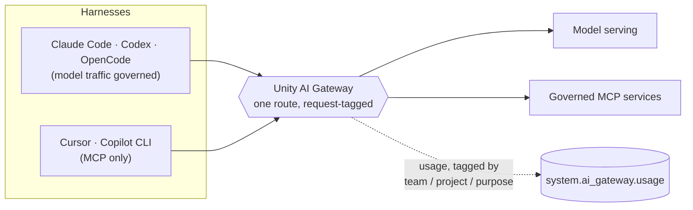

# Databricks Agentic Engineering Rails

**Get a coding agent set up on your own laptop — governed through Unity AI Gateway,
with permission tiers you have watched refuse something — in about thirty minutes.**


You have a laptop, a harness you already like, and a Databricks workspace. This
repository gets you from that to a session whose model spend is attributable, whose
tools are governed by Unity Catalog, and which will not force-push to a shared branch
because a file it read told it to.

**It is a guide, not a framework.** Everything that governs a session here is either a
Databricks tool (`ug`, the CLI) or a configuration file your harness already reads. There
is nothing to install into your own project, no wrapper to keep in step with five
upstreams, and no code of ours between you and your harness. That is a deliberate
reversal of an earlier design, recorded in
[decision 0006](docs/DECISIONS/0006-guidance-over-machinery.md).

```sh
git clone https://github.com/althrussell/databricks-agentic-engineering-rails
cd databricks-agentic-engineering-rails
./scripts/doctor.sh                       # is this laptop ready
```

Then open your harness's setup page. That is the whole path.

| Harness | Setup | Model traffic governed | Never-automatic tier | Real fence |
| :--- | :--- | :--- | :--- | :--- |
| Claude Code | [`harness/claude-code/SETUP.md`](harness/claude-code/SETUP.md) | Yes, verified | Deny rules — a text match | None |
| Codex CLI | [`harness/codex/SETUP.md`](harness/codex/SETUP.md) | Route not verified here | **Prose only** | `sandbox_mode = workspace-write` |
| OpenCode | [`harness/opencode/SETUP.md`](harness/opencode/SETUP.md) | Route not verified here | Deny verdicts — a text match | `"*": "ask"` catch-all |
| Cursor CLI | [`harness/cursor/SETUP.md`](harness/cursor/SETUP.md) | **No — tools only** | Deny rules — a text match | None |
| GitHub Copilot CLI | [`harness/copilot-cli/SETUP.md`](harness/copilot-cli/SETUP.md) | **No — tools only** | Deny flags, if you passed them | None |

Read the last two columns before you standardise on anything. `ug` routes model traffic
for three of the five; for Cursor and Copilot CLI it registers MCP servers only, so those
sessions' spend goes to a vendor's bill and never appears in your usage table. And the
column that actually constrains a session — a fence that removes a capability rather than
pattern-matching a command string — is empty for three of the five. Each `SETUP.md` ends
with what that harness cannot express, so the strongest one's guarantees cannot be
mistaken for yours.

---

## Contents

- [Who should read this](#who-should-read-this)
- [Which track are you on?](#which-track-are-you-on)
- [Why you should care](#why-you-should-care)
- [The four ideas](#the-four-ideas)
- [How the gate is enforced](#how-the-gate-is-enforced)
- [What is in this repository](#what-is-in-this-repository)
- [Documentation site](#documentation-site)
- [What this does not do](#what-this-does-not-do)
- [Contributing](#contributing)

---

## Who should read this

| If you are | Read this because | Start at |
|---|---|---|
| **An engineer about to use a coding agent on real work** | It gives you a harness that is configured, not improvised: permission tiers in the shape their format actually supports, a gateway route you have watched answering, and one command that tells you whether your machine is ready. | `./scripts/doctor.sh`, then your harness's `SETUP.md` |
| **A tech lead setting a team standard** | It is the standard, written down, with the decisions and the rejected alternatives attached — so you inherit an argument that has already been had rather than having it again in six months. | [`docs/02-permissions.md`](docs/02-permissions.md), then [`docs/DECISIONS/`](docs/DECISIONS/) |
| **A platform or workspace admin** | Agent traffic is model spend, and model spend is invisible until it is governed. This shows the route to enforce, the request tags that make usage attributable, and what a client-side environment variable does and does not control. | [`docs/03-gateway-auth.md`](docs/03-gateway-auth.md) |
| **A security or risk reviewer** | It states what each mechanism enforces, what defeats it, and what was deliberately not proved — including that nothing here stops a command before it runs. | [`docs/02-permissions.md`](docs/02-permissions.md), then your harness's `SETUP.md` |
| **Someone who will never clone this** | The six documents in [`docs/`](docs/) are written to be read on their own, with no repository and no network. | [`docs/00-start-here.md`](docs/00-start-here.md) |

If none of those is you and you have ten minutes, read
[The four ideas](#the-four-ideas). They are the whole argument.

## Which track are you on?

One question: **does the thing you are shipping have to run on Databricks?**

**Track A — you are building a Databricks App.** The platform is both your runtime and
your governance plane. Read [`docs/03-gateway-auth.md`](docs/03-gateway-auth.md) for how
sessions authenticate, then the AppKit and Apps sources in
[`docs/SOURCES.md`](docs/SOURCES.md). The lane table in
[`docs/05-ci-test-docs.md`](docs/05-ci-test-docs.md) is the shape a Track A repository's
CI should have.

**Track B — you are writing software with nothing to do with Databricks, and you want
the models governed anyway.** This is the more common case and it works: the gateway is
a model endpoint and an MCP registry, and neither cares what you are building.
Everything here applies except the Apps-specific sources. Your CI runs wherever your
code lives, which is why [`docs/05-ci-test-docs.md`](docs/05-ci-test-docs.md) is written
to be forge-agnostic.

**Both tracks share the same first thirty minutes.** The split only starts to matter
once you are productive, which is why the setup path does not ask you to choose.

## Why you should care

Three things go wrong quietly when a team starts using coding agents, and all three are
invisible until someone goes looking:

1. **Spend with no owner.** Every session is model spend. Without a governed route and
   request tags, the bill arrives as one number and nobody can attribute it to a team, a
   project or a purpose. Past spend cannot be retagged — those rows are already written.
2. **Tools with no governance.** An MCP server registered directly is subject to Unity
   Catalog permissions but invisible to the gateway — no usage row, no rate limit. The
   two routes look almost identical and only one of them is observable.
3. **A permission model that reads well and enforces nothing.** Most harness
   configuration formats have an allow list and a deny list. The interesting tier is the
   middle one, and the rules on either side match the *text* of a command rather than
   its effect.

None of that is fixed by telling people to be careful, and none of it is fixed by a
framework either. It is fixed by knowing which mechanism you are actually relying on,
which this repository is mostly about writing down.

## The four ideas

### One route


Every model call and every MCP call that *can* go through one governed gateway route
should. Not because it is tidier, but because it is the only place where spend,
attribution and refusal are observable at once.



Only `{workspace}/ai-gateway/mcp-services/{catalog.schema.name}` passes through the
gateway. The `{workspace}/api/2.0/mcp/...` route is governed by Unity Catalog but
invisible to the gateway: no usage row, no rate limit. Both work; only one is
observable. [`docs/03-gateway-auth.md`](docs/03-gateway-auth.md) has the distinction in
full.

**Two findings worth reading before you rely on the diagram.**

A session started with gateway environment variables is not proof that the gateway
served it. During this build, a session started with a deliberately invalid gateway
token answered normally — it had fallen back to the ambient harness login. Client-side
environment variables are a default, not a control. The only check that settles it is on
the workspace:

```sql
SELECT request_time, model_name, request_tags
FROM system.ai_gateway.usage
WHERE request_time > current_timestamp() - INTERVAL 15 MINUTES
ORDER BY request_time DESC
```

And **route availability is per workspace, not per product.** On the build workspace the
Anthropic route answered 200, the Codex route 404 and the Gemini route 400. A colleague's
working setup is evidence about their workspace, not yours.

Registering MCP servers is not free either. Every registered tool costs context in every
session whether or not it is called, and you cannot read the real figure off your own
config: the schemas are advertised by the server at connect time, so any offline count is
a lower bound. Compare what is advertised against what you allow in **both** directions —
a tool advertised but not allowed is context spent on nothing, and a tool allowed but not
advertised is a policy line that constrains nothing while reading as though it does.

### Three tiers


| Tier | Intent | Expressed as |
|---|---|---|
| **auto-allow** | Worst outcome is a wasted minute and a dirty working tree. Reversible with `git`, touches nothing outside the repository. | Allow rules |
| **ask** | The action leaves the machine or becomes visible to someone else. A prompt costs seconds; an unreviewed push costs a conversation. | The default posture, plus rules where the format has them |
| **never-automatic** | No approval flow should make this routine, because the failure is not recoverable by the person who approved it. | Deny rules, **and** the same tier restated in the always-loaded instruction file |

Sessions default to the mode that asks before acting. The middle tier is the one that
does the work, and it is the one most likely to be missing: an allow list plus a deny
list has no way to say "this is fine, but tell me first".

The never-automatic tier is stated twice — once as rules, once as prose — because the two
halves address different readers. A rule is matched against the command the model already
chose; the prose is read by the model doing the choosing. **Change one, change both**, or
you have a configuration that disagrees with itself.

Then be clear about which mechanism you are relying on, because they are not
interchangeable:

| Mechanism | Enforces | Defeated by |
|---|---|---|
| A deny rule (Claude Code, Cursor, OpenCode) | The spelling of the command you thought of | Any other spelling of the same action |
| A deny flag (Copilot CLI) | The same, and only in sessions where you passed the flag | Forgetting the flag |
| Prose in an instruction file (all five, Codex only) | Nothing. It is an instruction, not a control | Nothing needs to defeat it |
| `sandbox_mode = "workspace-write"` (Codex) | Writes outside the working tree — the capability is gone, not filtered | Turning it off |
| `"*": "ask"` catch-all (OpenCode) | Converts every command nobody listed into a prompt | An allow rule that is broader than you meant |

Note the shape of that table: the two entries that actually remove or narrow a capability
belong to two harnesses, and three of the five have nothing in that class at all. An
earlier version of this pack shipped a pre-execution hook to fill the gap. It was our
code sitting in the path of every command in every session, and it is gone —
[decision 0006](docs/DECISIONS/0006-guidance-over-machinery.md) explains the trade and
names what was lost.

None of these solves prompt injection. Every one of them limits the blast radius of an
injection that has already succeeded. And permission rules are not a security boundary:
they are the difference between an accident and a deliberate act.

### Evidence, not adjectives


Every source behind a claim is listed in [`docs/SOURCES.md`](docs/SOURCES.md) with the
URL, the HTTP status it returned and the date it was read — including the four
candidates that were **excluded**, and why.

Two words are used carefully, and they are not synonyms:

| Word | Means |
|---|---|
| **verified** | A real call over that route returned 200 during the build. One route earned it. |
| **documented** | A source describes the behaviour and nothing here exercised it. |

The second is used far more often than the first, every `SETUP.md` closes with what that
harness cannot express, and [`docs/03-gateway-auth.md`](docs/03-gateway-auth.md) closes
with what is not proved. The same standard applies to the checks: one that cannot run
exits non-zero rather than reporting a pass it has not earned. `make config` exits 2 when
`python3` is missing, because "nothing was checked" and "everything checks out" are
different results that must not print the same way.

### One entry point

Two ways to run the checks means one of them rots. So every check a human runs and every
check a pipeline runs is a target in the `Makefile`. **If CI does something the
`Makefile` cannot do, that is a defect in the `Makefile`.**

| Command | Needs | Belongs in |
|---|---|---|
| `make check` | Nothing. No network, no workspace, no credentials. | The pull-request lane. A check that can fail because someone else's web server is down does not belong here. |
| `make links-live` | Network. | A scheduled lane, or a manual run. Failures here are news about the world, not about the change under review. |

## How the gate is enforced

**The gate is a command, not a workflow file.** `make check` runs `lint`, `config` and
`links`, and exits non-zero on the first failure. It needs no network, no credentials and
no workspace, so it runs identically on a laptop and in whatever runner you already have.

This repository ships **no workflow file at all** — not a disabled one, not an example
one. Recorded with its cost in
[decision 0005](docs/DECISIONS/0005-the-gate-is-a-command.md). The immediate reason is
that the destination this pack is delivered into runs no GitHub Actions, which is a
common situation alongside a self-hosted forge with Actions disabled, GitLab, Azure
DevOps and a mirrored read-only remote. The better reason is that a pack whose
enforcement lives in `.github/workflows/` teaches its readers that CI is a GitHub
feature. The lesson worth teaching is that the gate is a command, and CI is whatever
happens to invoke it.

In your own repository, the porting exercise is one line:

```yaml
- run: make check
```

**The honest cost, not dressed up:** here, nothing blocks a push. The gate is a command
a developer runs and a reviewer can ask about, which is weaker than a required status
check because both can be skipped by one person in a hurry. Said here rather than
implying a coverage that does not exist.

## What is in this repository

```
Makefile                    the one entry point. `make help` lists everything
template-version.yml        the versions this pack was exercised against, read by
                            doctor.sh rather than restated in it

harness/
  README.md                 the two comparison tables: what is governed, what fences
  claude-code/  codex/      one directory per harness: a hand-written SETUP.md and the
  cursor/  copilot-cli/     two or three configuration files it tells you to copy, in
  opencode/                 that harness's own documented format

scripts/
  doctor.sh                 machine report. POSIX sh, so it works when python does not
  link-check.sh             internal links, anchors, link text, and the live URLs

docs/
  00-start-here.md          … 05-ci-test-docs.md — the six documents
  SOURCES.md                every URL, its status code, and the date it was read
  DECISIONS/                four decision records, each with its rejected
                            alternatives and the condition that should reopen it
  assets/img/               the illustrations, and a note on how they were made
  index.md                  the documentation site homepage
```

That is the whole of it: two shell scripts, some Markdown, and the configuration files
you copy. Nothing here generates anything, and nothing here runs inside your sessions.

Two files worth opening even if you read nothing else: your harness's `SETUP.md`, because
its last section is entirely about what your setup cannot do; and
[`docs/DECISIONS/README.md`](docs/DECISIONS/README.md), because it states that an agent
may draft a decision record but a human owns the decision, and why that rule exists.

## Documentation site

**<https://althrussell.github.io/databricks-agentic-engineering-rails/>**

Published with plain GitHub Pages, built from `main` and the `/docs` folder. **No
Actions, no build step, no workflow file** — the same constraint that shaped the gate.
Configuration is `docs/_config.yml`, the homepage is `docs/index.md`, and every page is a
Markdown file that renders correctly in a plain text editor, on GitHub, and on the site.

There is no PDF build. An earlier version had one; the Markdown was always the source,
and a second rendering was a second thing to keep true.

One thing worth knowing before you fork: **plain Pages needs the repository to be
public**, unless you have GitHub Enterprise Cloud. This repository was private first, and
enabling Pages returned `422 Your current plan does not support GitHub Pages for this
repository` — a plan limit, not a configuration mistake, and not obvious from the error.
If neither option is open to you nothing is lost: every document is Markdown in `docs/`
and reads in place.

## What this does not do

Stated here rather than discovered later.

- **It does not solve prompt injection.** Every mechanism limits blast radius. None
  prevents an injection.
- **It does not stop a command before it runs.** Nothing in this repository executes
  inside your session. Deny rules are a text match, and two harnesses have a
  working-directory fence you switch on yourself.
- **It does not make the permission rules a security boundary.** They are the difference
  between an accident and a deliberate act.
- **It does not sandbox anything.** Sandboxes and containers are out of scope. This
  configures the harness you are already running on the laptop you already have.
- **It does not touch your live configuration.** No script here writes to your harness
  configuration directories or a managed settings file. Each `SETUP.md` tells you which
  file to copy where, and you copy it. `ug` does write your user-scope configuration,
  which is its job, and every page that tells you to run it says so first.
- **It does not claim the five harnesses are equivalent.** Two do not route model traffic
  through the gateway, one cannot express the never-automatic tier as a rule at all, and
  three have no real fence. That is in the table at the top, not in a footnote.
- **It does not claim portability it has not tested.** macOS is the only platform the
  checks were run on, and one workspace is the only workspace anything was verified
  against.
- **It is not a Databricks product.** See [`DISCLAIMER.md`](DISCLAIMER.md). Nothing here
  is supported software, and every reference is to public documentation, recorded in
  [`docs/SOURCES.md`](docs/SOURCES.md) with the date it was read.

## Contributing

Read [`docs/DECISIONS/README.md`](docs/DECISIONS/README.md) first — the format, and the
rule about who owns a decision. Then:

```sh
make check          # must pass. It is hermetic, so there is no excuse
```

Three rules, each of which exists because of something that went wrong:

1. **A permission change and an instruction change travel together.** The rules and the
   always-loaded instruction file are two halves of the same tier. A pull request that
   moves one and not the other is a configuration that argues with itself, and it reviews
   as though nothing is wrong.
2. **A new claim about an external system needs a row in
   [`docs/SOURCES.md`](docs/SOURCES.md)** with the URL, the status it returned and the
   date. A claim that cannot name its source does not go in.
3. **Prefer deleting to adding.** This repository is smaller than it was by about four
   thousand lines, and it is more useful for it. Before adding a script, ask whether the
   thing it does could be a paragraph that teaches the reader to do it —
   [decision 0006](docs/DECISIONS/0006-guidance-over-machinery.md) is the standing
   argument.

A note on the checks themselves: each one has been run against a planted defect to prove
it fails. A checker that has only ever been seen passing is a checker nobody has tested.
If you add one, plant a defect and show it caught.

The images in `docs/assets/img/` are decorative and generated; if you fork this for your
own organisation, replace them, and keep the note explaining how.

## Licence

Code and documentation are licensed under the terms in [`LICENSE`](LICENSE). Third-party
notices are in [`NOTICE`](NOTICE). [`DISCLAIMER.md`](DISCLAIMER.md) states what this is
not.
